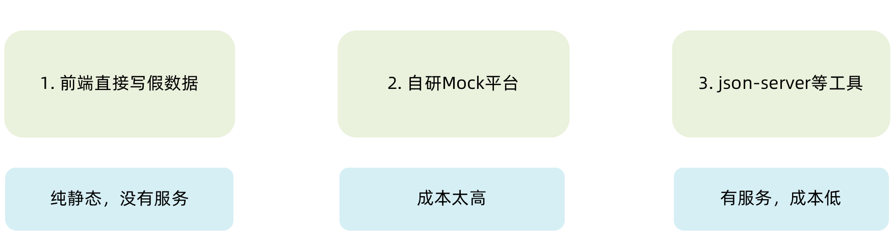
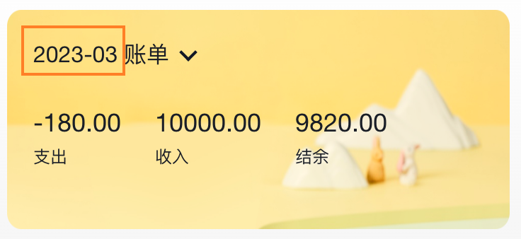
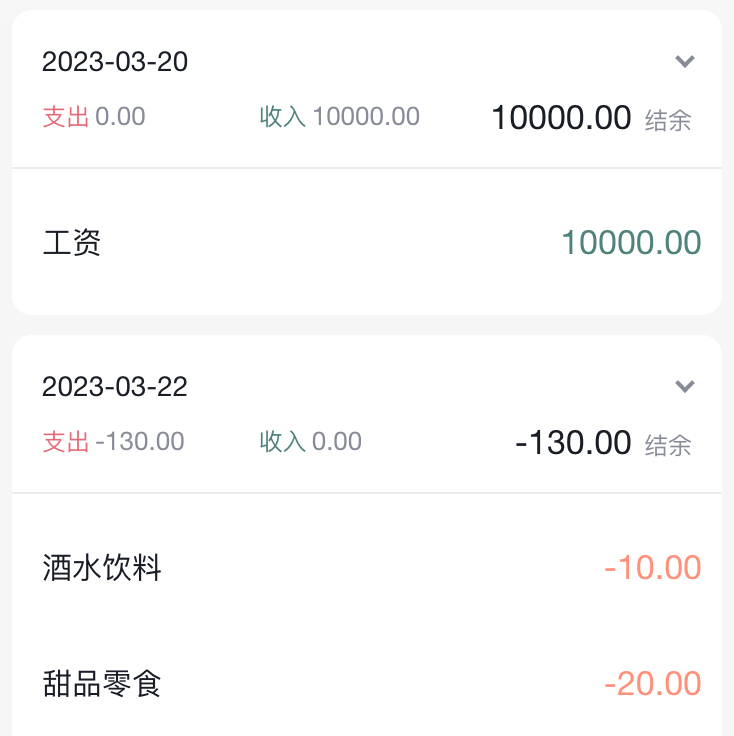

# 环境搭建
> 使用CRA创建项目，并安装必要依赖，包括下列基础包

1. Redux状态管理 -  @reduxjs/toolkit 、 react-redux
2. 路由 - react-router-dom
3. 时间处理 - dayjs
4. class类名处理 - classnames
5. 移动端组件库 - antd-mobile
6. 请求插件 - axios

# 配置别名路径
## 1. 背景知识
> 1. 路径解析配置（webpack），把 @/ 解析为 src/
> 2. 路径联想配置（VsCode），VsCode 在输入 @/ 时，自动联想出来对应的 src/下的子级目录


## 2. 路径解析配置
配置步骤：

1. 安装craco
npm i -D @craco/craco
2. 项目根目录下创建配置文件
craco.config.js
3. 配置文件中添加路径解析配置
4. 包文件中配置启动和打包命令


## 3. 联想路径配置
配置步骤：

1. 根目录下新增配置文件 - jsconfig.json
2. 添加路径提示配置
```json
{
  "compilerOptions":{
    "baseUrl":"./",
    "paths":{
      "@/*":[
        "src/*"
      ]
    }
  }
}
```

# 数据Mock实现
> 在前后端分类的开发模式下，前端可以在没有实际后端接口的支持下先进行接口数据的模拟，进行正常的业务功能开发

## 1. 常见的Mock方式


## 2. json-server实现Mock
实现步骤：

1.  项目中安装json-server
 npm i -D json-server 
2.  准备一个json文件 （素材里获取）
3.  添加启动命令 


4.  访问接口进行测试 
# 整体路由设计

1. 俩个一级路由 （Layout / new）2. 俩个二级路由 （Layout - mouth/year）

# antD主题定制
## 1. 定制方案

## 2. 实现方式

1. 全局定制


2. 局部定制


## 3. 记账本主题色
```css
:root:root {
  --adm-color-primary: rgb(105, 174, 120);
}
```

# Redux管理账目列表


```javascript
// 账单列表相关store

import { createSlice } from '@reduxjs/toolkit'
import axios from 'axios'

const billStore = createSlice({
  name: 'bill',
  // 数据状态state
  initialState: {
    billList: []
  },
  reducers: {
    // 同步修改方法
    setBillList (state, action) {
      state.billList = action.payload
    }
  }
})

// 解构actionCreater函数
const { setBillList } = billStore.actions
// 编写异步
const getBillList = () => {
  return async (dispatch) => {
    // 编写异步请求
    const res = await axios.get('http://localhost:8888/ka')
    // 触发同步reducer
    dispatch(setBillList(res.data))
  }
}

export { getBillList }
// 导出reducer
const reducer = billStore.reducer

export default reducer
```


```javascript
// 组合子模块 导出store实例

import { configureStore } from '@reduxjs/toolkit'
import billReducer from './modules/billStore'

const store = configureStore({
  reducer: {
    bill: billReducer
  }
})

export default store
```

```jsx
import router from './router'
import { Provider } from 'react-redux'

const root = ReactDOM.createRoot(document.getElementById('root'))
root.render(
  <Provider store={store}>
    <RouterProvider router={router} />
  </Provider>
)
```
# TabBar功能实现


## 1. 静态布局实现
配套静态模版和样式文件
```jsx
import { TabBar } from "antd-mobile"
import { useEffect } from "react"
import { Outlet } from "react-router-dom"
import { useDispatch } from 'react-redux'
import { getBillList } from "@/store/modules/billStore"
import './index.scss'
import {
  BillOutline,
  CalculatorOutline,
  AddCircleOutline
} from 'antd-mobile-icons'

const tabs = [
  {
    key: '/month',
    title: '月度账单',
    icon: <BillOutline />,
  },
  {
    key: '/new',
    title: '记账',
    icon: <AddCircleOutline />,
  },
  {
    key: '/year',
    title: '年度账单',
    icon: <CalculatorOutline />,
  },
]

const Layout = () => {
  const dispatch = useDispatch()
  useEffect(() => {
    dispatch(getBillList())
  }, [dispatch])
  return (
    <div className="layout">
      <div className="container">
        <Outlet />
      </div>
      <div className="footer">
        <TabBar>
          {tabs.map(item => (
            <TabBar.Item key={item.key} icon={item.icon} title={item.title} />
          ))}
        </TabBar>
      </div>
    </div>
  )
}

export default Layout
```
```css
.layout {
  .container {
    position: fixed;
    top: 0;
    bottom: 50px;
  }
  .footer {
    position: fixed;
    bottom: 0;
    width: 100%;
  }
}
```
## 2. 切换路由实现
> 监听change事件，在事件回调中调用路由跳转方法

```jsx
 // 切换菜单跳转路由
  const navigate = useNavigate()
  const swithRoute = (path) => {
    console.log(path)
    navigate(path)
  }

  return (
    <div className="layout">
      <div className="footer">
        <TabBar onChange={swithRoute}>
          {/* 省略... */}
        </TabBar>
      </div>
    </div>
  )
```

# 月度账单-统计区域


## 1. 准备静态结构
```jsx
import { NavBar, DatePicker } from 'antd-mobile'
import './index.scss'

const Month = () => {
  return (
    <div className="monthlyBill">
      <NavBar className="nav" backArrow={false}>
        月度收支
      </NavBar>
      <div className="content">
        <div className="header">
          {/* 时间切换区域 */}
          <div className="date">
            <span className="text">
              2023 | 3月账单
            </span>
            <span className='arrow expand'></span>
          </div>
          {/* 统计区域 */}
          <div className='twoLineOverview'>
            <div className="item">
              <span className="money">{100}</span>
              <span className="type">支出</span>
            </div>
            <div className="item">
              <span className="money">{200}</span>
              <span className="type">收入</span>
            </div>
            <div className="item">
              <span className="money">{200}</span>
              <span className="type">结余</span>
            </div>
          </div>
          {/* 时间选择器 */}
          <DatePicker
            className="kaDate"
            title="记账日期"
            precision="month"
            visible={false}
            max={new Date()}
          />
        </div>
      </div>
    </div >
  )
}

export default Month
```

```css
.monthlyBill {
  --ka-text-color: #191d26;
  height: 100%;
  background: linear-gradient(180deg, #ffffff, #f5f5f5 100%);
  background-size: 100% 240px;
  background-repeat: no-repeat;
  background-color: rgba(245, 245, 245, 0.9);
  color: var(--ka-text-color);

  .nav {
    --adm-font-size-10: 16px;
    color: #121826;
    background-color: transparent;
    .adm-nav-bar-back-arrow {
      font-size: 20px;
    }
  }

  .content {
    height: 573px;
    padding: 0 10px;
    overflow-y: scroll;
    -ms-overflow-style: none; /* Internet Explorer 10+ */
    scrollbar-width: none; /* Firefox */
    &::-webkit-scrollbar {
      display: none; /* Safari and Chrome */
    }

    > .header {
      height: 135px;
      padding: 20px 20px 0px 18.5px;
      margin-bottom: 10px;
      background-image: url(https://zqran.gitee.io/images/ka/month-bg.png);
      background-size: 100% 100%;

      .date {
        display: flex;
        align-items: center;
        margin-bottom: 25px;
        font-size: 16px;

        .arrow {
          display: inline-block;
          width: 7px;
          height: 7px;
          margin-top: -3px;
          margin-left: 9px;
          border-top: 2px solid #121826;
          border-left: 2px solid #121826;
          transform: rotate(225deg);
          transform-origin: center;
          transition: all 0.3s;
        }
        .arrow.expand {
          transform: translate(0, 2px) rotate(45deg);
        }
      }
    }
  }
  .twoLineOverview {
    display: flex;
    justify-content: space-between;
    width: 250px;

    .item {
      display: flex;
      flex-direction: column;

      .money {
        height: 24px;
        line-height: 24px;
        margin-bottom: 5px;
        font-size: 18px;
      }
      .type {
        height: 14px;
        line-height: 14px;
        font-size: 12px;
      }
    }
  }
}
```

## 2. 点击切换时间选择框

> 实现思路：
> 1. 准备一个状态数据
> 2. 点击切换状态
> 3. 根据状态控制弹框打开关闭以及箭头样式


```jsx
import { NavBar, DatePicker } from 'antd-mobile'
import './index.scss'
import {  useState } from "react"
import classNames from "classnames"

const Month = () => {
  // 控制时间选择器打开关闭
  const [dateVisible, setDateVisible] = useState(false)
  // 时间选择框确实事件
  const dateConfirm = (date) => {
    // 关闭弹框
    setDateVisible(false)
  }

  return (
    <div className="monthlyBill">
      <NavBar className="nav" backArrow={false}>
        月度收支
      </NavBar>
      <div className="content">
        <div className="header">
          {/* 时间切换区域 */}
          <div className="date" onClick={() => setDateVisible(true)}>
            {/* 省略.. */}
            <span className={classNames('arrow', dateVisible && 'expand')}></span>
          </div>
          {/* 统计区域 */}
        
          {/* 时间选择器 */}
          <DatePicker
            className="kaDate"
            title="记账日期"
            precision="month"
            visible={dateVisible}
            max={new Date()}
            onConfirm={dateConfirm}
          />
        </div>
      </div>
    </div >
  )
}

export default Month
```
## 3. 切换时间显示


> 实现思路：
> 1. 以当前时间作为默认值
> 2. 在时间切换时完成时间修改


```jsx
import dayjs from "dayjs"

const [currentMonth, setCurrentMonth] = useState(() => {
    return dayjs().format('YYYY-MM')
})

const dateConfirm = (date) => {
  setDateVisible(false)
  const month = dayjs(date).format('YYYY-MM')
  setCurrentMonth(month)
}
```

## 4. 统计功能实现
> 实现思路：
> 1. 按月分组
> 2. 根据获取到的时间作为key取当月的账单数组
> 3. 根据当月的账单数组计算支出、收入、总计

```jsx
// 按月分组
const billList = useSelector(state => state.bill.billList)
const monthGroup = useMemo(() => {
  return _.groupBy(billList, item => dayjs(item.date).format('YYYY-MM'))
}, [billList])

// 根据获取到的时间作为key取当月的账单数组
const dateConfirm = (date) => {
  const monthKey = dayjs(date).format('YYYY-MM')
  setMonthList(monthGroup[monthKey])
}

// 计算统计
const overview = useMemo(() => {
  const income = currentMonthList.filter(item => item.type === 'income')
    .reduce((a, c) => a + c.money, 0)
  const pay = currentMonthList.filter(item => item.type === 'pay')
    .reduce((a, c) => a + c.money, 0)
  return {
    income,
    pay,
    total: income + pay
  }
}, [currentMonthList])
```
## 5. 完整代码
```jsx
import { useSelector } from "react-redux"
import { NavBar, DatePicker } from 'antd-mobile'
import './index.scss'
import _ from 'lodash'
import dayjs from "dayjs"
import { useMemo, useState } from "react"
import { useEffect } from "react"
import classNames from "classnames"

const Month = () => {
  // 按月分组
  const billList = useSelector(state => state.bill.billList)
  const monthGroup = useMemo(() => {
    return _.groupBy(billList, item => dayjs(item.date).format('YYYY-MM'))
  }, [billList])

  // 控制时间选择器打开关闭
  const [dateVisible, setDateVisible] = useState(false)
  const [currentMonthList, setMonthList] = useState([])
  const [currentMonth, setCurrentMonth] = useState(() => {
    return dayjs().format('YYYY-MM')
  })

  const dateConfirm = (date) => {
    setDateVisible(false)
    const monthKey = dayjs(date).format('YYYY-MM')
    setCurrentMonth(monthKey)
    setMonthList(monthGroup[monthKey])
  }

  // 首次加载
  useEffect(() => {
    const list = monthGroup[dayjs().format('YYYY-MM')]
    if(list){
      setMonthList(list)
    }
  }, [monthGroup])

  // 计算统计
  const overview = useMemo(() => {
    if (!currentMonthList) return { income: 0, pay: 0, total: 0 }
    const income = currentMonthList.filter(item => item.type === 'income')
      .reduce((a, c) => a + c.money, 0)
    const pay = currentMonthList.filter(item => item.type === 'pay')
      .reduce((a, c) => a + c.money, 0)
    return {
      income,
      pay,
      total: income + pay
    }
  }, [currentMonthList])

  return (
    <div className="monthlyBill">
      <NavBar className="nav" backArrow={false}>
        月度收支
      </NavBar>
      <div className="content">
        <div className="header">
          {/* 时间切换区域 */}
          <div className="date" onClick={() => setDateVisible(true)}>
            <span className="text">
              {currentMonth} 账单
            </span>
            <span className={classNames('arrow', dateVisible && 'expand')}></span>
          </div>
          {/* 统计区域 */}
          <div className='twoLineOverview'>
            <div className="item">
              <span className="money">{overview.pay.toFixed(2)}</span>
              <span className="type">支出</span>
            </div>
            <div className="item">
              <span className="money">{overview.income.toFixed(2)}</span>
              <span className="type">收入</span>
            </div>
            <div className="item">
              <span className="money">{(overview.total).toFixed(2)}</span>
              <span className="type">结余</span>
            </div>
          </div>
          {/* 时间选择器 */}
          <DatePicker
            className="kaDate"
            title="记账日期"
            precision="month"
            visible={dateVisible}
            max={new Date()}
            onConfirm={dateConfirm}
          />
        </div>
      </div>
    </div >
  )
}

export default Month
```

# 月度账单-单日统计列表实现

## 1. 准备组件和配套样式
```jsx
import classNames from 'classnames'
import './index.scss'

const DailyBill = () => {
  return (
    <div className={classNames('dailyBill')}>
      <div className="header">
        <div className="dateIcon">
          <span className="date">{'03月23日'}</span>
          <span className={classNames('arrow')}></span>
        </div>
        <div className="oneLineOverview">
          <div className="pay">
            <span className="type">支出</span>
            <span className="money">{100}</span>
          </div>
          <div className="income">
            <span className="type">收入</span>
            <span className="money">{200}</span>
          </div>
          <div className="balance">
            <span className="money">{100}</span>
            <span className="type">结余</span>
          </div>
        </div>
      </div>
    </div>
  )
}
export default DailyBill
```
配套样式
```css
.dailyBill {
  margin-bottom: 10px;
  border-radius: 10px;
  background: #ffffff;

  .header {
    --ka-text-color: #888c98;
    padding: 15px 15px 10px 15px;

    .dateIcon {
      display: flex;
      justify-content: space-between;
      align-items: center;
      height: 21px;
      margin-bottom: 9px;
      .arrow {
        display: inline-block;
        width: 5px;
        height: 5px;
        margin-top: -3px;
        margin-left: 9px;
        border-top: 2px solid #888c98;
        border-left: 2px solid #888c98;
        transform: rotate(225deg);
        transform-origin: center;
        transition: all 0.3s;
      }
      .arrow.expand {
        transform: translate(0, 2px) rotate(45deg);
      }

      .date {
        font-size: 14px;
      }
    }
  }
  .oneLineOverview {
    display: flex;
    justify-content: space-between;

    .pay {
      flex: 1;
      .type {
        font-size: 10px;
        margin-right: 2.5px;
        color: #e56a77;
      }
      .money {
        color: var(--ka-text-color);
        font-size: 13px;
      }
    }

    .income {
      flex: 1;
      .type {
        font-size: 10px;
        margin-right: 2.5px;
        color: #4f827c;
      }
      .money {
        color: var(--ka-text-color);
        font-size: 13px;
      }
    }

    .balance {
      flex: 1;
      margin-bottom: 5px;
      text-align: right;

      .money {
        line-height: 17px;
        margin-right: 6px;
        font-size: 17px;
      }
      .type {
        font-size: 10px;
        color: var(--ka-text-color);
      }
    }
  }

  .billList {
    padding: 15px 10px 15px 15px;
    border-top: 1px solid #ececec;
    .bill {
      display: flex;
      justify-content: space-between;
      align-items: center;
      height: 43px;
      margin-bottom: 15px;

      &:last-child {
        margin-bottom: 0;
      }

      .icon {
        margin-right: 10px;
        font-size: 25px;
      }
      .detail {
        flex: 1;
        padding: 4px 0;
        .billType {
          display: flex;
          align-items: center;
          height: 17px;
          line-height: 17px;
          font-size: 14px;
          padding-left: 4px;
        }
      }
      .money {
        font-size: 17px;

        &.pay {
          color: #ff917b;
        }
        &.income {
          color: #4f827c;
        }
      }
    }
  }
}
.dailyBill.expand {
  .header {
    border-bottom: 1px solid #ececec;
  }
  .billList {
    display: block;
  }
}
```
## 2. 按日分组账单数据


```javascript
// 把当前月按日分组账单数据
  const dayGroup = useMemo(() => {
    const group = _.groupBy(currentMonthList, (item) => dayjs(item.date).format('YYYY-MM-DD'))
    return {
      dayKeys: Object.keys(group),
      group
    }
  }, [currentMonthList])
  console.log(dayGroup)
```
## 3. 遍历日账单组件并传入参数
```jsx
 {/* 日账单 */}
{dayGroup.dayKeys.map(dayKey => (
  <DailyBill key={dayKey} date={dayKey} billList={dayGroup.group[dayKey]} />
))}
```

## 4. 接收数据计算统计渲染页面
```jsx
const DailyBill = ({ date, billList }) => {
  const dayResult = useMemo(() => {
    // 支出  /  收入  / 结余
    const pay = billList.filter(item => item.type === 'pay').reduce((a, c) => a + c.money, 0)
    const income = billList.filter(item => item.type === 'income').reduce((a, c) => a + c.money, 0)
    return {
      pay,
      income,
      total: pay + income
    }
  }, [billList])
  return (
    <div className={classNames('dailyBill')}>
      <div className="header">
        <div className="dateIcon">
          <span className="date">{date}</span>
        </div>
        <div className="oneLineOverview">
          <div className="pay">
            <span className="type">支出</span>
            <span className="money">{dayResult.pay.toFixed(2)}</span>
          </div>
          <div className="income">
            <span className="type">收入</span>
            <span className="money">{dayResult.income.toFixed(2)}</span>
          </div>
          <div className="balance">
            <span className="money">{dayResult.total.toFixed(2)}</span>
            <span className="type">结余</span>
          </div>
        </div>
      </div>
    </div>
  )
}

export default DailyBill
```
# 月度账单-单日账单列表展示


## 1. 渲染基础列表
```jsx
{/* 单日列表 */}
<div className="billList">
  {billList.map(item => {
    return (
      <div className="bill" key={item.id}>
        <div className="detail">
          <div className="billType">{item.useFor}</div>
        </div>
        <div className={classNames('money', item.type)}>
          {item.money.toFixed(2)}
        </div>
      </div>
    )
  })}
</div>
```
## 2. 适配Type
1-准备静态数据
```javascript
export const billListData = {
  pay: [
    {
      type: 'foods',
      name: '餐饮',
      list: [
        { type: 'food', name: '餐费' },
        { type: 'drinks', name: '酒水饮料' },
        { type: 'dessert', name: '甜品零食' },
      ],
    },
    {
      type: 'taxi',
      name: '出行交通',
      list: [
        { type: 'taxi', name: '打车租车' },
        { type: 'longdistance', name: '旅行票费' },
      ],
    },
    {
      type: 'recreation',
      name: '休闲娱乐',
      list: [
        { type: 'bodybuilding', name: '运动健身' },
        { type: 'game', name: '休闲玩乐' },
        { type: 'audio', name: '媒体影音' },
        { type: 'travel', name: '旅游度假' },
      ],
    },
    {
      type: 'daily',
      name: '日常支出',
      list: [
        { type: 'clothes', name: '衣服裤子' },
        { type: 'bag', name: '鞋帽包包' },
        { type: 'book', name: '知识学习' },
        { type: 'promote', name: '能力提升' },
        { type: 'home', name: '家装布置' },
      ],
    },
    {
      type: 'other',
      name: '其他支出',
      list: [{ type: 'community', name: '社区缴费' }],
    },
  ],
  income: [
    {
      type: 'professional',
      name: '其他支出',
      list: [
        { type: 'salary', name: '工资' },
        { type: 'overtimepay', name: '加班' },
        { type: 'bonus', name: '奖金' },
      ],
    },
    {
      type: 'other',
      name: '其他收入',
      list: [
        { type: 'financial', name: '理财收入' },
        { type: 'cashgift', name: '礼金收入' },
      ],
    },
  ],
}

export const billTypeToName = Object.keys(billListData).reduce((prev, key) => {
  billListData[key].forEach(bill => {
    bill.list.forEach(item => {
      prev[item.type] = item.name
    })
  })
  return prev
}, {})
```
2-适配type
```javascript
 <div className="billType">{billTypeToName[item.useFor]}</div>
```
# 月度账单-切换打开关闭


```jsx
// 声明状态
const [visible, setVisible] = useState(false)

// 控制箭头
 <span 
   className={classNames('arrow', !visible && 'expand')} 
   onClick={() => setVisible(!visible)}></span>
     
// 控制列表显示
<div className="billList" style={{ display: !visible && 'none' }}></div>
```

# 月度账单-Icon组件封装

## 1. 准备静态结构
```jsx
const Icon = () => {
  return (
    
  )
}

export default Icon
```
## 2. 设计参数
```jsx
const BASE_URL = 'https://yjy-teach-oss.oss-cn-beijing.aliyuncs.com/reactbase/ka/'

const Icon = ({ type }) => {
  return (
    
  )
}

export default Icon
```
## 3. 使用组件
```jsx
<div className="billList" style={{ display: visible ? 'block' : 'none' }}>
    {billList.map(item => {
      return (
        <div className="bill" key={item.id}>
          <Icon type={item.useFor} />
        </div>
      )
    })}
  </div>
```

# 记账功能
## 记账 - 结构渲染
```jsx
import { Button, DatePicker, Input, NavBar } from 'antd-mobile'
import Icon from '@/components/Icon'
import './index.scss'
import classNames from 'classnames'
import { billListData } from '@/contants'
import { useNavigate } from 'react-router-dom'

const New = () => {
  const navigate = useNavigate()
  return (
    <div className="keepAccounts">
      <NavBar className="nav" onBack={() => navigate(-1)}>
        记一笔
      </NavBar>

      <div className="header">
        <div className="kaType">
          <Button
            shape="rounded"
            className={classNames('selected')}
          >
            支出
          </Button>
          <Button
            className={classNames('')}
            shape="rounded"
          >
            收入
          </Button>
        </div>

        <div className="kaFormWrapper">
          <div className="kaForm">
            <div className="date">
              <Icon type="calendar" className="icon" />
              <span className="text">{'今天'}</span>
              <DatePicker
                className="kaDate"
                title="记账日期"
                max={new Date()}
              />
            </div>
            <div className="kaInput">
              <Input
                className="input"
                placeholder="0.00"
                type="number"
              />
              <span className="iconYuan">¥</span>
            </div>
          </div>
        </div>
      </div>

      <div className="kaTypeList">
        {billListData['pay'].map(item => {
          return (
            <div className="kaType" key={item.type}>
              <div className="title">{item.name}</div>
              <div className="list">
                {item.list.map(item => {
                  return (
                    <div
                      className={classNames(
                        'item',
                        ''
                      )}
                      key={item.type}

                    >
                      <div className="icon">
                        <Icon type={item.type} />
                      </div>
                      <div className="text">{item.name}</div>
                    </div>
                  )
                })}
              </div>
            </div>
          )
        })}
      </div>

      <div className="btns">
        <Button className="btn save">
          保 存
        </Button>
      </div>
    </div>
  )
}

export default New
```
配套样式
```css
.keepAccounts {
  --ka-bg-color: #daf2e1;
  --ka-color: #69ae78;
  --ka-border-color: #191d26;

  height: 100%;
  background-color: var(--ka-bg-color);

  .nav {
    --adm-font-size-10: 16px;
    color: #121826;
    background-color: transparent;
    &::after {
      height: 0;
    }

    .adm-nav-bar-back-arrow {
      font-size: 20px;
    }
  }

  .header {
    height: 132px;

    .kaType {
      padding: 9px 0;
      text-align: center;

      .adm-button {
        --adm-font-size-9: 13px;

        &:first-child {
          margin-right: 10px;
        }
      }
      .selected {
        color: #fff;
        --background-color: var(--ka-border-color);
      }
    }

    .kaFormWrapper {
      padding: 10px 22.5px 20px;

      .kaForm {
        display: flex;
        padding: 11px 15px 11px 12px;
        border: 0.5px solid var(--ka-border-color);
        border-radius: 9px;
        background-color: #fff;

        .date {
          display: flex;
          align-items: center;
          height: 28px;
          padding: 5.5px 5px;
          border-radius: 4px;
          // color: #4f825e;
          color: var(--ka-color);
          background-color: var(--ka-bg-color);

          .icon {
            margin-right: 6px;
            font-size: 17px;
          }
          .text {
            font-size: 16px;
          }
        }

        .kaInput {
          flex: 1;
          display: flex;
          align-items: center;

          .input {
            flex: 1;
            margin-right: 10px;
            --text-align: right;
            --font-size: 24px;
            --color: var(--ka-color);
            --placeholder-color: #d1d1d1;
          }

          .iconYuan {
            font-size: 24px;
          }
        }
      }
    }
  }

  .container {
  }
  .kaTypeList {
    height: 490px;
    padding: 20px 11px;
    padding-bottom: 70px;
    overflow-y: scroll;
    background: #ffffff;
    border-radius: 20px 20px 0 0;
    -ms-overflow-style: none; /* Internet Explorer 10+ */
    scrollbar-width: none; /* Firefox */
    &::-webkit-scrollbar {
      display: none; /* Safari and Chrome */
    }

    .kaType {
      margin-bottom: 25px;
      font-size: 12px;
      color: #333;

      .title {
        padding-left: 5px;
        margin-bottom: 5px;
        font-size: 13px;
        color: #808080;
      }
      .list {
        display: flex;

        .item {
          width: 65px;
          height: 65px;
          padding: 9px 0;
          margin-right: 7px;
          text-align: center;
          border: 0.5px solid #fff;
          &:last-child {
            margin-right: 0;
          }

          .icon {
            height: 25px;
            line-height: 25px;
            margin-bottom: 5px;
            font-size: 25px;
          }
        }
        .item.selected {
          border: 0.5px solid var(--ka-border-color);
          border-radius: 5px;
          background: var(--ka-bg-color);
        }
      }
    }
  }

  .btns {
    position: fixed;
    bottom: 15px;
    width: 100%;
    text-align: center;

    .btn {
    width: 200px;
    --border-width: 0;
    --background-color: #fafafa;
    --text-color: #616161;
    &:first-child {
    margin-right: 15px;
    }
    }
    .btn.save {
    --background-color: var(--ka-bg-color);
    --text-color: var(--ka-color);
    }
    }
  }

```

## 记账 - 支出和收入切换
```jsx
const new = ()=>{
  // 1. 区分账单状态
  const [billType, setBillType] = useState('income')
  return (
     <div className="keepAccounts">
      <div className="kaType">
        {/* 2. 点击切换状态 */}
        <Button
          shape="rounded"
          className={classNames(billType==='pay'?'selected':'')}
          onClick={() => setBillType('pay')}
        >
          支出
        </Button>
        <Button
          className={classNames(billType==='income'?'selected':'')}
          onClick={() => setBillType('income')}
          shape="rounded"
        >
          收入
        </Button>
      </div>
      {/* 2. 适配数据 */}
      <div className="kaTypeList">
          {billListData[billType].map(item => {
            
          })}
      </div>
    </div>
  )
}
```
## 记账 - 新增一笔
```jsx
import { useDispatch } from 'react-redux'

const New = () => {
  // 收集金额
  const [money, setMoney] = useState(0)
  const moneyChange = (value) => {
    setMoney(value)
  }

  // 收集账单类型
  const [useFor, setUseFor] = useState('')
  const dispatch = useDispatch()
  // 保存账单
  const saveBill = () => {
    // 收集表单数据
    const data = {
      type: billType,
      money: billType === 'pay' ? -money : +money,
      date: new Date(),
      useFor: useFor
    }
    console.log(data)
    dispatch(addBillList(data))
  }
  return (
    <div className="keepAccounts">
      <NavBar className="nav" onBack={() => navigate(-1)}>
        记一笔
      </NavBar>

      <div className="header">
        <div className="kaType">
          <Button
            shape="rounded"
            className={classNames(billType === 'pay' ? 'selected' : '')}
            onClick={() => setBillType('pay')}
          >
            支出
          </Button>
          <Button
            className={classNames(billType === 'income' ? 'selected' : '')}
            shape="rounded"
            onClick={() => setBillType('income')}
          >
            收入
          </Button>
        </div>

        <div className="kaFormWrapper">
          <div className="kaForm">
            <div className="date">
              <Icon type="calendar" className="icon" />
              <span className="text">{'今天'}</span>
              <DatePicker
                className="kaDate"
                title="记账日期"
                max={new Date()}
              />
            </div>
            <div className="kaInput">
              <Input
                className="input"
                placeholder="0.00"
                type="number"
                value={money}
                onChange={moneyChange}
              />
              <span className="iconYuan">¥</span>
            </div>
          </div>
        </div>
      </div>

      <div className="kaTypeList">
        {/* 数据区域 */}
        {billListData[billType].map(item => {
          return (
            <div className="kaType" key={item.type}>
              <div className="title">{item.name}</div>
              <div className="list">
                {item.list.map(item => {
                  return (
                    <div
                      className={classNames(
                        'item',
                        ''
                      )}
                      key={item.type}
                      onClick={() => setUseFor(item.type)}
                    >
                      <div className="icon">
                        <Icon type={item.type} />
                      </div>
                      <div className="text">{item.name}</div>
                    </div>
                  )
                })}
              </div>
            </div>
          )
        })}
      </div>

      <div className="btns">
        <Button className="btn save" onClick={saveBill}>
          保 存
        </Button>
      </div>
    </div>
  )
}

export default New
```

