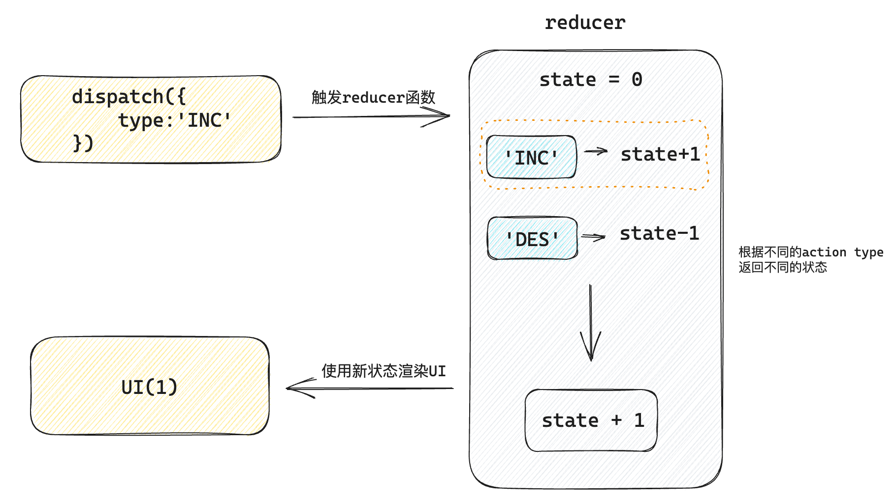

# 基础使用
作用: 让 React 管理多个**相对关联**的状态数据
```jsx
import { useReducer } from 'react'

// 1. 定义reducer函数，根据不同的action返回不同的新状态
function reducer(state, action) {
  switch (action.type) {
    case 'INC':
      return state + 1
    case 'DEC':
      return state - 1
    default:
      return state
  }
}

function App() {
  // 2. 使用useReducer分派action
  const [state, dispatch] = useReducer(reducer, 0)
  return (
    <>
      {/* 3. 调用dispatch函数传入action对象 触发reducer函数，分派action操作，使用新状态更新视图 */}
      <button onClick={() => dispatch({ type: 'DEC' })}>-</button>
      {state}
      <button onClick={() => dispatch({ type: 'INC' })}>+</button>
    </>
  )
}

export default App
```

# 更新流程

# 分派action传参
> 做法：分派action时如果想要传递参数，需要在action对象中添加一个payload参数，放置状态参数

```jsx
// 定义reducer

import { useReducer } from 'react'

// 1. 根据不同的action返回不同的新状态
function reducer(state, action) {
  console.log('reducer执行了')
  switch (action.type) {
    case 'INC':
      return state + 1
    case 'DEC':
      return state - 1
    case 'UPDATE':
      return state + action.payload
    default:
      return state
  }
}

function App() {
  // 2. 使用useReducer分派action
  const [state, dispatch] = useReducer(reducer, 0)
  return (
    <>
      {/* 3. 调用dispatch函数传入action对象 触发reducer函数，分派action操作，使用新状态更新视图 */}
      <button onClick={() => dispatch({ type: 'DEC' })}>-</button>
      {state}
      <button onClick={() => dispatch({ type: 'INC' })}>+</button>
      <button onClick={() => dispatch({ type: 'UPDATE', payload: 100 })}>
        update to 100
      </button>
    </>
  )
}

export default App
```

